# Vigilant Service Configuration Flow

## System Architecture Flow

```mermaid
graph TB
    subgraph "Configuration Loading"
        A[config/services/*.yml] --> B[LoadServiceProfiles()]
        B --> C[Environment Variable Substitution]
        C --> D[Configuration Validation]
        D --> E[Apply Defaults]
        E --> F[Service Name Mapping]
    end
    
    subgraph "Alert Processing"
        G[Prometheus Alerts] --> H[Alert Pattern Matching]
        H --> I{Service Found?}
        I -->|Yes| J[Load Service Config]
        I -->|No| K[Mark as Unknown]
        J --> L[Process Logs & Metrics]
    end
    
    subgraph "Data Collection"
        L --> M[Elasticsearch Query]
        L --> N[Prometheus Metrics]
        L --> O[Log File Fallback]
        M --> P[Pattern Matching]
        N --> Q[Threshold Evaluation]
        O --> P
    end
    
    subgraph "Analysis & Output"
        P --> R[Symptom Detection]
        Q --> S[Risk Calculation]
        R --> T[LLM Analysis Context]
        S --> T
        T --> U[Generate Insights]
        U --> V[API Response]
        U --> W[WebSocket Update]
    end
    
    F --> H
```

## Service Identification Flow

```mermaid
sequenceDiagram
    participant P as Prometheus
    participant V as Vigilant
    participant C as Config System
    participant E as Elasticsearch
    participant L as LLM
    
    P->>V: Alert: "IstioProxyHighCPU"
    V->>C: Look up alert pattern
    C->>C: alert_pattern: "IstioProxyHighCPU" → name: "IstioProxyHighCPU"
    C->>V: Return service config
    
    V->>E: Query logs with namespace filter
    E->>V: Return matching logs
    V->>V: Apply log patterns
    
    V->>P: Query metrics
    P->>V: Return metric values
    V->>V: Evaluate thresholds
    
    V->>L: Send context + data
    L->>V: Return analysis
    V->>V: Update risk tracking
```



## Configuration Processing Pipeline


## Runtime Alert Processing


## Data Flow Through Service Configuration


## Configuration Field Relationships


## Environment Variable Resolution

```mermaid
graph LR
    subgraph "Configuration File"
        A[${ES_INDEX_PATTERN:-fluentbit-*}]
        B[${NAMESPACE:-production}]
        C[$SERVICE_NAME]
    end
    
    subgraph "Environment Variables"
        D[ES_INDEX_PATTERN=logs-*]
        E[NAMESPACE=staging]
        F[SERVICE_NAME=payment-api]
    end
    
    subgraph "Resolution Process"
        G[Parse ${VAR:-default}]
        H[Check Environment]
        I[Apply Default if Missing]
        J[Substitute Value]
    end
    
    subgraph "Final Configuration"
        K[index_pattern: logs-*]
        L[namespace_filter: staging]
        M[query_tpl: up{job="payment-api"}]
    end
    
    A --> G
    B --> G
    C --> G
    D --> H
    E --> H
    F --> H
    G --> H
    H --> I
    I --> J
    J --> K
    J --> L
    J --> M
```

## Service Configuration Lifecycle


## Alert Processing State Machine


## Configuration Validation Flow


This comprehensive flow documentation shows how Vigilant processes service configurations from initial loading through runtime alert processing and analysis generation.