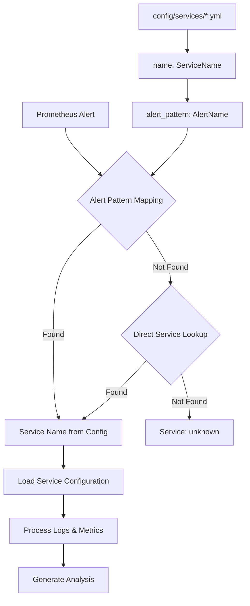

# Service Configuration Guide

## Overview

Vigilant uses YAML-based service configurations to define how alerts are monitored, analyzed, and processed. Each service configuration provides comprehensive monitoring rules including log pattern detection, metrics evaluation, and AI analysis context.

## Table of Contents

- [Quick Start](#quick-start)
- [Configuration Structure](#configuration-structure)
- [Service Identification Flow](#service-identification-flow)
- [Configuration Fields](#configuration-fields)
- [Environment Variables](#environment-variables)
- [Creating New Services](#creating-new-services)
- [Best Practices](#best-practices)
- [Examples](#examples)
- [Troubleshooting](#troubleshooting)

## Quick Start

### Generate a New Service Configuration

```bash
# Basic service
./vigilant-config-gen -name="MyAPI" -desc="REST API service"

# Advanced service with custom settings
./vigilant-config-gen \
  -name="PaymentService" \
  -desc="Payment processing microservice" \
  -tags="payment,api,critical" \
  -namespace="payments" \
  -type="microservice" \
  -criticality="critical" \
  -escalation="payments-team → sre-team"
```

### File Location
Place your service configurations in: `config/services/`

**Supported Extensions:** `.yml`, `.yaml`

## Configuration Structure

```yaml
---
# Service Metadata
name: "ServiceName"                    # Required: Primary service identifier
description: "Service description"     # Optional: Human-readable description
version: "1.0"                        # Optional: Configuration version
tags: ["tag1", "tag2"]                # Optional: Service tags for categorization
maintainer: "team@company.com"        # Optional: Contact information

# Alert Matching
alert_pattern: "AlertName"            # Required: Prometheus alert name to match
severity_levels: ["warning", "critical"] # Optional: Supported severity levels

# Data Sources
data_sources:
  elasticsearch:                      # Primary log source
    index_pattern: "logs-*"          # ES index pattern
    time_range_minutes: 15           # Time window for log search
    scan_limit: 500                  # Maximum logs to scan
    namespace_filter: "production"   # Kubernetes namespace filter
    required_fields: ["@timestamp", "log"] # Required ES fields
  
  log_file: "/var/log/app.log"       # Fallback log file

# Symptom Detection
log_patterns:                        # Log pattern matching rules
  - name: "error_pattern"            # Pattern identifier
    description: "Error detection"   # Human-readable description
    regex: "(?i)error|exception"     # Regular expression
    severity: "warning"              # Pattern severity

# Metrics Monitoring
metrics:                             # Prometheus metrics to evaluate
  - name: "ServiceUp"                # Metric identifier
    description: "Service availability" # Human-readable description
    query_tpl: 'up{job="service"}'   # Prometheus query template
    operator: "<"                    # Comparison operator
    threshold: 1.0                   # Threshold value
    weight: 10                       # Weight for risk calculation
    unit: "boolean"                  # Metric unit

# LLM Analysis Context
analysis_context:                    # Context for AI analysis
  service_type: "microservice"       # Service type classification
  criticality: "high"               # Business criticality
  common_causes: ["issue1", "issue2"] # Common failure causes
  escalation_path: "team → manager"  # Escalation procedure
```

## Service Identification Flow



### Identification Priority

1. **Alert Pattern Match**: `alert_pattern` field → service name
2. **Direct Service Match**: Alert name → service name (backward compatibility)
3. **Fallback**: Mark as "unknown" service

### Example Flow

```
1. Prometheus fires: "PaymentServiceDown"
2. Look up alert_pattern: "PaymentServiceDown" 
3. Find config with: name: "PaymentService", alert_pattern: "PaymentServiceDown"
4. Use "PaymentService" configuration for processing
```

## Configuration Fields

### Service Metadata

| Field | Type | Required | Description |
|-------|------|----------|-------------|
| `name` | string | ✅ | **Primary service identifier** - used for service matching |
| `description` | string | ❌ | Human-readable service description |
| `version` | string | ❌ | Configuration version for tracking changes |
| `tags` | array | ❌ | Service tags for categorization and filtering |
| `maintainer` | string | ❌ | Team/person responsible for this service |

### Alert Matching

| Field | Type | Required | Description |
|-------|------|----------|-------------|
| `alert_pattern` | string | ✅ | Prometheus alert name that triggers this config |
| `severity_levels` | array | ❌ | Supported alert severity levels |

### Data Sources

#### Elasticsearch Configuration

| Field | Type | Required | Description |
|-------|------|----------|-------------|
| `index_pattern` | string | ❌ | ES index pattern (default: `fluentbit-*`) |
| `time_range_minutes` | int | ❌ | Log search time window (default: 15) |
| `scan_limit` | int | ❌ | Maximum logs to scan (default: 500) |
| `namespace_filter` | string | ❌ | Kubernetes namespace to filter |
| `required_fields` | array | ❌ | Required ES document fields |

#### Log File Configuration

| Field | Type | Required | Description |
|-------|------|----------|-------------|
| `log_file` | string | ❌ | Fallback log file path when ES unavailable |

### Log Patterns

| Field | Type | Required | Description |
|-------|------|----------|-------------|
| `name` | string | ✅ | Pattern identifier |
| `description` | string | ❌ | Human-readable pattern description |
| `regex` | string | ✅ | **Regular expression for pattern matching** |
| `severity` | string | ❌ | Pattern severity (warning, critical) |

### Metrics

| Field | Type | Required | Description |
|-------|------|----------|-------------|
| `name` | string | ✅ | Metric identifier |
| `description` | string | ❌ | Human-readable metric description |
| `query_tpl` | string | ✅ | **Prometheus query template** |
| `operator` | string | ✅ | Comparison operator (`>`, `<`, `>=`, `<=`, `==`, `!=`) |
| `threshold` | float | ✅ | **Threshold value for comparison** |
| `weight` | int | ✅ | **Weight for risk score calculation** |
| `unit` | string | ❌ | Metric unit (boolean, percentage, count, etc.) |

### Analysis Context

| Field | Type | Required | Description |
|-------|------|----------|-------------|
| `service_type` | string | ❌ | Service classification for LLM context |
| `criticality` | string | ❌ | Business criticality level |
| `common_causes` | array | ❌ | Common failure causes for LLM hints |
| `escalation_path` | string | ❌ | Escalation procedure description |

## Environment Variables

All configuration fields support environment variable substitution:

### Syntax
- `${VARIABLE_NAME}` - With default: `${VAR:-default_value}`
- `$VARIABLE_NAME` - Simple substitution

### Examples

```yaml
data_sources:
  elasticsearch:
    index_pattern: "${ES_INDEX_PATTERN:-fluentbit-*}"
    namespace_filter: "${SERVICE_NAMESPACE:-production}"
    time_range_minutes: ${LOG_RETENTION_MINUTES:-15}

metrics:
  - name: "ServiceUp"
    query_tpl: 'up{job="${SERVICE_NAME:-myservice}"}'
```

### Common Environment Variables

```bash
# Elasticsearch settings
export ES_INDEX_PATTERN="logs-*"
export ES_SCAN_LIMIT="1000"

# Service-specific settings  
export SERVICE_NAMESPACE="production"
export SERVICE_NAME="payment-api"

# Monitoring settings
export LOG_RETENTION_MINUTES="30"
export METRIC_THRESHOLD="0.95"
```

## Creating New Services

### Method 1: Using Config Generator (Recommended)

```bash
# Basic service
./vigilant-config-gen -name="MyService"

# Complete service configuration
./vigilant-config-gen \
  -name="DatabaseService" \
  -desc="PostgreSQL database monitoring" \
  -tags="database,postgresql,critical" \
  -namespace="data" \
  -type="database" \
  -criticality="critical" \
  -escalation="dba-team"
```

### Method 2: Manual Creation

1. Create file: `config/services/MyService.yml`
2. Use template structure above
3. Customize patterns and metrics
4. Test with: `./vigilant -llm=false`

### Method 3: Copy Existing Service

```bash
# Copy similar service
cp config/services/IstioProxyHighCPU.yml config/services/MyProxy.yml

# Edit the copy
vim config/services/MyProxy.yml
```

## Best Practices

### Naming Conventions

```yaml
# ✅ Good: Clear, descriptive names
name: "PaymentAPI"
alert_pattern: "PaymentServiceDown"

# ❌ Avoid: Generic or unclear names
name: "Service1" 
alert_pattern: "Alert"
```

### Log Patterns

```yaml
# ✅ Good: Specific, well-documented patterns
log_patterns:
  - name: "payment_failure"
    description: "Payment processing failures with transaction ID"
    regex: "(?i)payment.*failed.*transaction[_\\s]+id[_\\s]*:?[_\\s]*([a-zA-Z0-9-]+)"
    severity: "critical"

# ❌ Avoid: Overly broad patterns
log_patterns:
  - name: "error"
    regex: "error"
    severity: "warning"
```

### Metrics Selection

```yaml
# ✅ Good: Meaningful metrics with appropriate weights
metrics:
  - name: "PaymentSuccess"
    description: "Payment success rate percentage"
    query_tpl: 'rate(payment_success_total[5m]) / rate(payment_total[5m]) * 100'
    operator: "<"
    threshold: 95.0
    weight: 10  # High weight for critical business metric
    unit: "percentage"

# ❌ Avoid: Metrics without business context
metrics:
  - name: "SomeMetric"
    query_tpl: 'up'
    operator: "<"
    threshold: 1
    weight: 1
```

### Environment Variables

```yaml
# ✅ Good: Use environment variables for environment-specific values
data_sources:
  elasticsearch:
    index_pattern: "${ES_INDEX_PATTERN:-fluentbit-*}"
    namespace_filter: "${PAYMENT_NAMESPACE:-payments}"

# ❌ Avoid: Hardcoded environment-specific values
data_sources:
  elasticsearch:
    index_pattern: "production-logs-2024"
    namespace_filter: "prod-payments"
```

## Examples

### Microservice Configuration

```yaml
---
name: "UserAPI"
description: "User management REST API service"
version: "2.1"
tags: ["api", "users", "authentication"]
maintainer: "backend-team@company.com"

alert_pattern: "UserServiceDown"
severity_levels: ["warning", "critical"]

data_sources:
  elasticsearch:
    index_pattern: "${ES_INDEX_PATTERN:-fluentbit-*}"
    time_range_minutes: 20
    scan_limit: 1000
    namespace_filter: "${USER_SERVICE_NAMESPACE:-users}"
    required_fields: ["@timestamp", "log", "kubernetes.container_name"]
  
  log_file: "/var/log/user-api/app.log"

log_patterns:
  - name: "authentication_failure"
    description: "User authentication failures"
    regex: "(?i)(authentication.*failed|invalid.*credentials|login.*failed)"
    severity: "warning"
    
  - name: "database_connection_error"
    description: "Database connectivity issues"
    regex: "(?i)(database.*connection.*failed|db.*timeout|connection.*pool.*exhausted)"
    severity: "critical"
    
  - name: "api_rate_limit_exceeded"
    description: "API rate limiting triggered"
    regex: "(?i)(rate.*limit.*exceeded|too.*many.*requests)"
    severity: "warning"

metrics:
  - name: "UserServiceUp"
    description: "User service availability"
    query_tpl: 'up{job="user-api"}'
    operator: "<"
    threshold: 1.0
    weight: 10
    unit: "boolean"
    
  - name: "UserAPILatency"
    description: "API response time P95"
    query_tpl: 'histogram_quantile(0.95, rate(http_request_duration_seconds_bucket{service="user-api"}[5m]))'
    operator: ">"
    threshold: 2.0
    weight: 7
    unit: "seconds"
    
  - name: "UserAPIErrorRate"
    description: "API error rate percentage"
    query_tpl: 'rate(http_requests_total{service="user-api",status=~"5.."}[5m]) / rate(http_requests_total{service="user-api"}[5m]) * 100'
    operator: ">"
    threshold: 5.0
    weight: 8
    unit: "percentage"

analysis_context:
  service_type: "rest_api"
  criticality: "high"
  common_causes:
    - "database_connectivity_issues"
    - "authentication_service_down"
    - "high_traffic_load"
    - "memory_leaks"
    - "configuration_errors"
  escalation_path: "backend-team → sre-team → on-call-engineer"
```

### Database Service Configuration

```yaml
---
name: "PostgresDatabase"
description: "PostgreSQL primary database cluster"
version: "1.3"
tags: ["database", "postgresql", "critical", "stateful"]
maintainer: "dba-team@company.com"

alert_pattern: "PostgreSQLDown"
severity_levels: ["warning", "critical"]

data_sources:
  elasticsearch:
    index_pattern: "${DB_LOG_INDEX:-database-logs-*}"
    time_range_minutes: 30
    scan_limit: 500
    namespace_filter: "${DB_NAMESPACE:-databases}"
    required_fields: ["@timestamp", "log", "database.name"]
  
  log_file: "/var/lib/postgresql/data/log/postgresql.log"

log_patterns:
  - name: "connection_limit_reached"
    description: "Maximum connections exceeded"
    regex: "(?i)(too.*many.*connections|connection.*limit.*exceeded)"
    severity: "critical"
    
  - name: "deadlock_detected"
    description: "Database deadlock events"
    regex: "(?i)(deadlock.*detected|process.*deadlocked)"
    severity: "warning"
    
  - name: "disk_space_low"
    description: "Database storage space issues"
    regex: "(?i)(no.*space.*left|disk.*full|storage.*full)"
    severity: "critical"
    
  - name: "slow_query"
    description: "Slow query execution detected"
    regex: "(?i)(slow.*query|duration.*[5-9]\\d{3,}.*ms)"
    severity: "warning"

metrics:
  - name: "PostgreSQLUp"
    description: "PostgreSQL instance availability"
    query_tpl: 'pg_up{instance=~"${DB_INSTANCE_PATTERN:-.+}"}'
    operator: "<"
    threshold: 1.0
    weight: 10
    unit: "boolean"
    
  - name: "DatabaseConnections"
    description: "Active database connections percentage"
    query_tpl: '(pg_stat_database_numbackends / pg_settings_max_connections) * 100'
    operator: ">"
    threshold: 80.0
    weight: 8
    unit: "percentage"
    
  - name: "DatabaseLockWaits"
    description: "Lock wait events per second"
    query_tpl: 'rate(pg_stat_database_conflicts_total[5m])'
    operator: ">"
    threshold: 10.0
    weight: 6
    unit: "per_second"

analysis_context:
  service_type: "database"
  criticality: "critical"
  common_causes:
    - "connection_pool_exhaustion"
    - "disk_space_issues"
    - "long_running_queries"
    - "deadlock_cascade"
    - "replication_lag"
    - "backup_failures"
  escalation_path: "dba-team → senior-dba → database-architect"
```

### Infrastructure Service Configuration

```yaml
---
name: "KubernetesCluster"
description: "Kubernetes cluster health monitoring"
version: "1.0"
tags: ["kubernetes", "infrastructure", "cluster"]
maintainer: "platform-team@company.com"

alert_pattern: "KubernetesClusterIssue"
severity_levels: ["warning", "critical"]

data_sources:
  elasticsearch:
    index_pattern: "${K8S_LOG_INDEX:-kubernetes-*}"
    time_range_minutes: 15
    scan_limit: 2000
    namespace_filter: "kube-system"
    required_fields: ["@timestamp", "log", "kubernetes.container_name"]
  
  log_file: "/var/log/kubernetes/kube-apiserver.log"

log_patterns:
  - name: "api_server_error"
    description: "Kubernetes API server errors"
    regex: "(?i)(api.*server.*error|etcd.*connection.*failed)"
    severity: "critical"
    
  - name: "node_not_ready"
    description: "Node readiness issues"
    regex: "(?i)(node.*not.*ready|node.*unreachable)"
    severity: "critical"
    
  - name: "pod_eviction"
    description: "Pod eviction events"
    regex: "(?i)(evicting.*pod|pod.*evicted)"
    severity: "warning"

metrics:
  - name: "KubernetesAPIUp"
    description: "Kubernetes API server availability"
    query_tpl: 'up{job="kubernetes-apiservers"}'
    operator: "<"
    threshold: 1.0
    weight: 10
    unit: "boolean"
    
  - name: "NodesReady"
    description: "Number of ready nodes"
    query_tpl: 'kube_node_status_condition{condition="Ready",status="true"}'
    operator: "<"
    threshold: 3
    weight: 9
    unit: "count"
    
  - name: "PodsRunning"
    description: "Percentage of pods in running state"
    query_tpl: '(sum(kube_pod_status_phase{phase="Running"}) / sum(kube_pod_status_phase)) * 100'
    operator: "<"
    threshold: 90.0
    weight: 7
    unit: "percentage"

analysis_context:
  service_type: "kubernetes_infrastructure"
  criticality: "critical"
  common_causes:
    - "etcd_cluster_issues"
    - "api_server_overload"
    - "node_resource_exhaustion"
    - "network_partitioning"
    - "storage_backend_failures"
  escalation_path: "platform-team → kubernetes-sre → infrastructure-lead"
```

## Troubleshooting

### Common Issues

#### 1. Service Not Found

**Symptom:**
```
No profile found for alert 'MyAlert' or service 'MyService'
```

**Solution:**
- Check `alert_pattern` matches the Prometheus alert name exactly
- Verify `name` field is set correctly
- Ensure config file is in `config/services/` directory

#### 2. Invalid Configuration

**Symptom:**
```
Warning: invalid configuration in config/services/MyService.yml: log pattern 0 is missing regex
```

**Solution:**
- Check all required fields are present
- Validate regex patterns compile correctly
- Ensure metric queries are valid PromQL

#### 3. Environment Variables Not Substituted

**Symptom:**
```
ES scan for MyService: index=${ES_INDEX_PATTERN:-fluentbit-*}
```

**Solution:**
- Set environment variables before running Vigilant
- Check variable syntax: `${VAR}` or `${VAR:-default}`
- Verify environment variable names are correct

#### 4. No Logs Found

**Symptom:**
```
ES DEBUG: Found 0 logs in index logs-*
```

**Solutions:**
- Check `index_pattern` matches your Elasticsearch indices
- Verify `namespace_filter` is correct
- Adjust `time_range_minutes` if logs are older
- Check Elasticsearch connectivity

### Debugging Tips

#### Enable Debug Mode
```bash
# Run with debug output
./vigilant -llm=false | grep DEBUG
```

#### Validate Configuration
```bash
# Test configuration loading
./vigilant -llm=false | head -20
```

#### Check Environment Variables
```bash
# Print resolved configuration
echo "Index Pattern: ${ES_INDEX_PATTERN:-fluentbit-*}"
echo "Namespace: ${SERVICE_NAMESPACE:-default}"
```

#### Test Regex Patterns
```bash
# Test regex in your language of choice
python3 -c "import re; print(re.search(r'(?i)error', 'ERROR: test'))"
```

### Configuration Validation

The system automatically validates:

- ✅ Required fields presence
- ✅ Regex pattern compilation  
- ✅ Metric query syntax
- ✅ Duplicate service names
- ✅ Field type correctness

### Performance Considerations

- **Log Scan Limits**: Keep `scan_limit` reasonable (500-2000) to avoid ES timeouts
- **Time Windows**: Use appropriate `time_range_minutes` for your use case
- **Pattern Complexity**: Complex regex patterns can slow log processing
- **Metric Frequency**: Consider metric collection frequency when setting thresholds

---

## Quick Reference

### File Structure
```
config/services/
├── MyAPI.yml
├── DatabaseService.yml
├── KubernetesCluster.yml
└── ...
```

### Key Commands
```bash
# Generate new service config
./vigilant-config-gen -name="MyService"

# Run Vigilant with environment variables
ES_INDEX_PATTERN="logs-*" ./vigilant -llm=false

# Test configuration
./vigilant -llm=false | head -20
```

### Essential Fields
- ✅ `name`: Service identifier  
- ✅ `alert_pattern`: Prometheus alert to match
- ✅ `log_patterns[].regex`: Log pattern matching
- ✅ `metrics[].query_tpl`: Prometheus query
- ✅ `metrics[].threshold`: Metric threshold

For more examples and advanced configurations, see the `config/services/` directory in your Vigilant installation.